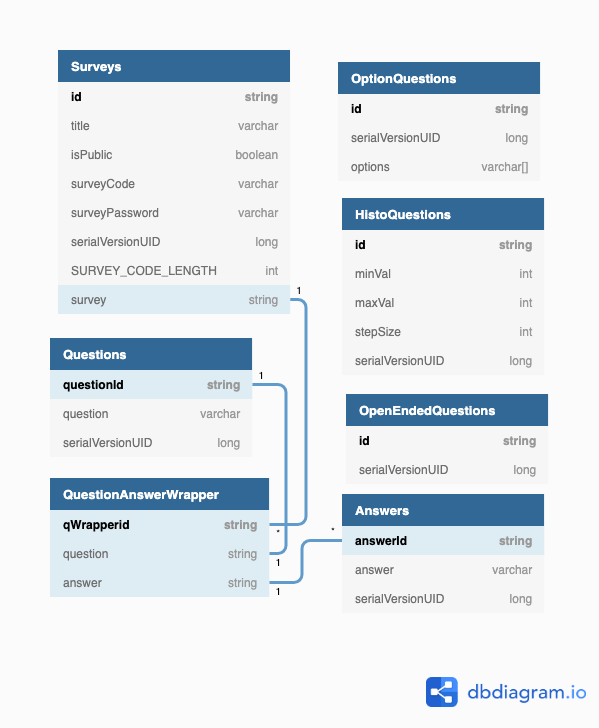

# SurveyMonkey

## Current State as per the Kanban

### Completed
- Weekly Scrum - March 29nd 2021
- Weekly Scrum - April 5th 2021
- Use a NOSQL database (in accordance to our presentation topic)
- Create survey result page but without password
- Create a submission page that pops us after user submits survey answers
- Actual storage of survey answers.
- Display available surveys on the homepage
- Updated the README
- Improve upon password-less survey result feature and some page interfaces
- UML Diagrams
- View/Template for the search survey result (currently JSON)
- Survey Results Page
- Fix known bugs & results page layout

### In progress
- Repo cleanup for submission

### Backlog
- None

### Plan for the next Sprint
- None

### Database Schema as of Milestone 3

### UML Class Diagram as of Milestone 3

### Sequence Diagram as of Milestone 3

