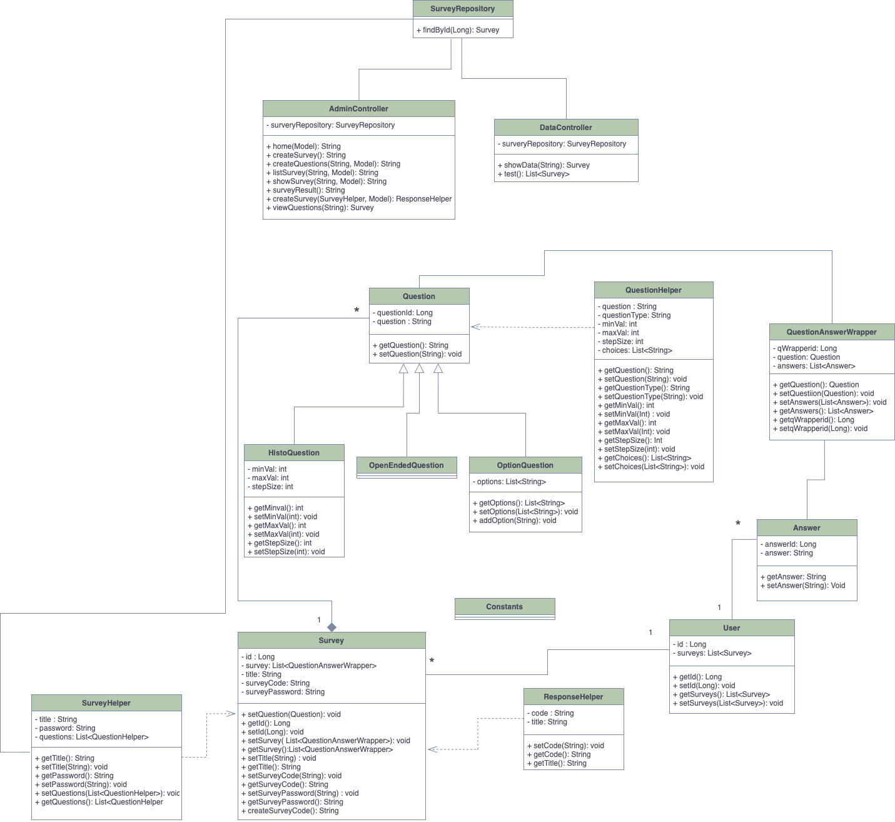

# SurveyMonkey

## Current State as per the Kanban

### Completed
- Weekly Scrum - March 22nd 2021
- Show survey page tests
- Randomly Generated Survey Code
- Survey Display Page
- survey Confirmation Page
- Updated the README
- UML Diagrams
- Weekly Scrum - March 15th 2021
- Backend Architecture
- Configure entities
- Implement Controllers
- Form input
- Dynamic input form

### In progress
- Add survey results page

### Backlog
- Fix known bugs and results page layout

### Plan for the next Sprint
- Improve further on the Front End Design.
- Implement the survey results page
- More testing
- Increase password utilization

### Database Schema as of Milestone 2

### UML Class Diagram as of Milestone 2

### Sequence Diagram as of Milestone 2

